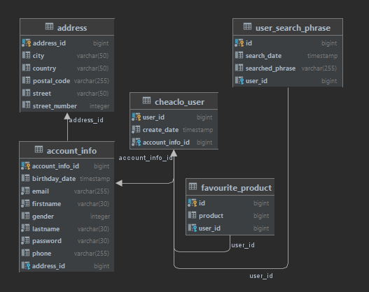

# Users Database Microservice

Project is a microservice, which is part of Cheaclo project. The application is a layer supporting communication between users database and other microservices.

## Tech stack

`java 16`

`spring-boot 2.5.2`

`postgresql`

## Details

### Database schema

### General information

Database is implemented on PostgreSQL relational database system. Currently, data is stored on local machine, but after deployment it will be moved to cloud. Basic user data is storage in the database, additionally user's favourite products and searched phrases are implemented. All functionality is shared by API, which is ready to use buy other microservices.

### Distributing data

Also, API for [Client front](https://github.com/cheaclo/client-front) is provided:

`[POST] /user/add` - add user to the database

`[GET] /user/country/all` - return all available countries

`[DELETE] /user/delete/{id}` - delete user indicated by passed id

`[PUT] /user/edit` - edit user fields in the database

`[POST] /user/favourite-product/add` - add product to user's favourites

`[GET] /user/favourite-product/get?id` - returns favourite products of user with id passed in the parameter

`[DELETE] /user/favourite-product/delete/id?userId` - delete favourite product by id passed in the parameter

`[GET] /user/favourite-product/find?productId&userId` - return favourite product, which match passed product id and user id in the parameter

`[POST] /user/phrase/add` - add passed phrase to the database

`[POST] /user/sign-in"` - return information if sign in credentials are valid

